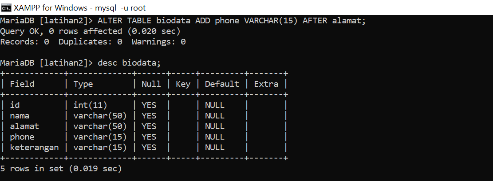
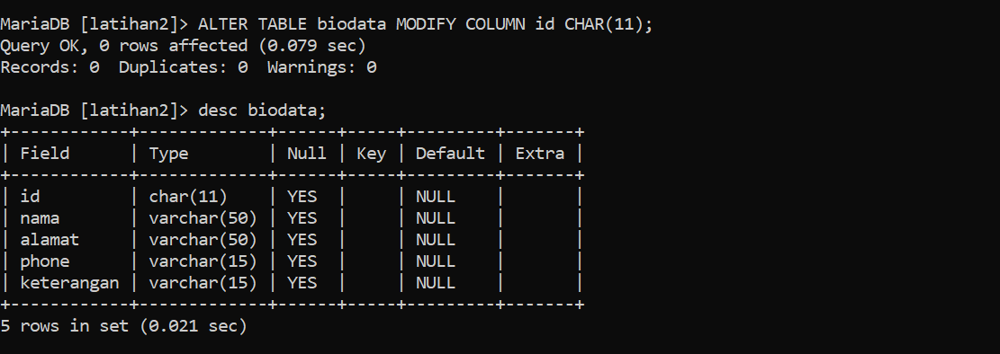

# TUGAS Basis_data MySQL
## Latihan1

## 1. Buat sebuah database dengan nama latihan2!
``` 
CREATE DATABASE latihan1;
```
#### Output 


## 2. Buat sebuah tabel dengan nama biodata (nama, alamat) didalam database latihan1!
```
CREATE TABLE biodata (nama VARCHAR(50), alamat VARCHAR(50));
```
#### Output 


## 3. Tambahkan sebuah kolom keterangan (varchar 15), sebagai kolom terakhir!
```
ALTER TABLE biodata ADD COLUMN keterangan varchar(15) AFTER alamat;
```
#### Output 


## 4. Tambahkan kolom id (int 11) di awal (sebagai kolom pertama)!
```
ALTER TABLE biodata ADD COLUMN id int(11) First;
```
#### Output 


## 5. Sisipkan sebuah kolom dengan nama phone (varchar 15) setelah kolom alamat!
```
ALTER TABLE biodata ADD COLUMN phone varchar(15);
```
#### Output 


## 6. Ubah tipe data kolom id menjadi char(11)!
```
ALTER TABLE biodata MODIFY COLUMN id VARCHAR(11);
```
#### Output 


## 7. Ubah nama kolom phone menjadi hp (varchar 20)!
```
ALTER TABLE biodata CHANGE COLUMN phone hp varchar(20);
```
#### Output 
![gambar]SSlatihan1/7.png)

## 8. Tambahkan kolom email setelah kolom hp
```
ALTER TABLE biodata ADD COLUMN email text after hp;
```
#### Output 
![gambar]SSlatihan1/8.png)

## 9. Hapus kolom keterangan dari tabel!
```
alter table biodata drop keterangan;
```
#### Output 


## 10. Ganti nama tabel menjadi data_mahasiswa!
```
alter table biodata rename data_mahasiswa;
```
#### Output 


## 11. Ganti nama field id menjadi nim!
```
ALTER TABLE data_mahasiswa CHANGE COLUMN id nim varchar(11);
```
#### Output 


## 12. Jadikan nim sebagai PRIMARY KEY!
```
ALTER TABLE data_mahasiswa ADD PRIMARY KEY(nim);
```
#### Output 


## 13. Jadikan kolom email sebagai UNIQUE KEY
```
ALTER TABLE data_mahasiswa ADD CONSTRAINT email unique KEY(email);
```
#### Output 


### EVALUASI DAN PERTANYAAN.?
#### 1. Apa maksud dari int (11)?
#### = int (11) nunjukkan bahwa kolom memiliki tipe data bilangan bulat (integer) dengan ukuran 11 digit 

#### 2. Ketika kita melihat struktur tabel dengan perintah desc, ada kolom Null yang berisi Yes dan No. Apa maksudnya ?

#### = Jika kolom "Null" adalah "YES", itu berarti kolom tersebut diizinkan untuk memiliki nilai NULL.

#### = Jika kolom "Null" adalah "NO", maka kolom tersebut tidak diizinkan untuk memiliki nilai NULL.

